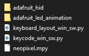

# DIY-macro-keypad
Code for custom-built macro keypad with 8 [Neokey Socket Breakouts](https://www.adafruit.com/product/4978), together with a Raspberry Pi Pico. This repository is mostly meant as a backup of the code, as well as a git usage refresher for myself.

## Dependencies
So far, this code requires the following modules to function properly:

- [CircuitPython](https://github.com/adafruit/circuitpython):
Typically installed on your board.
- [Adafruit HID](https://github.com/adafruit/Adafruit_CircuitPython_HID): Used for keyboard keycodes.
- [Circuitpython Keyboard Layouts](https://github.com/Neradoc/Circuitpython_Keyboard_Layouts): Used for additional languages keyboard layouts. Only Swedish layout currently needed.
- [Adafruit NeoPixel](https://github.com/adafruit/Adafruit_CircuitPython_NeoPixel): Used to control the NeoPixel lights.
- [Adafruit LED Animation](https://github.com/adafruit/Adafruit_CircuitPython_LED_Animation): To perform animation patterns with the NeoPixel lights.

Your boards lib-folder should look something like this:

## Usage
After installing dependencies above, simply copy main.py and colors.py to the board an restart the device!
